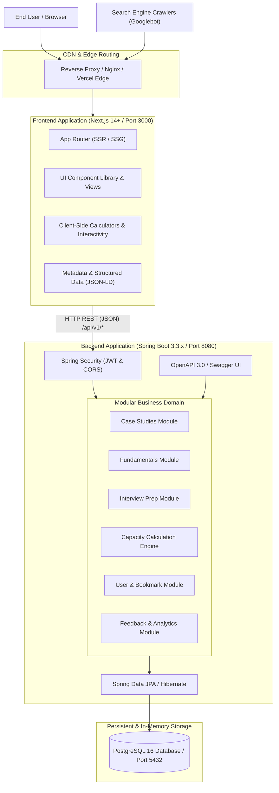

# Architecture Design — System Design Lab

## 1. System Topology Overview

System Design Lab employs a decoupled Monorepo architecture featuring a Next.js App Router frontend for ultra-fast SEO-optimized rendering and a robust Spring Boot 3.3.x backend providing business logic, calculations, persistent user interactions, and REST APIs.



## 2. Backend Architecture (`backend/`)

### 2.1 Modular Monolith Package Structure
Following the enterprise standard specified in conventions: `com.app.modules.{feature}.{layer}`:

```text
com.app
├── SystemDesignLabApplication.java
├── common/
│   ├── base/
│   │   ├── BaseEntity.java
│   │   └── ApiResponse.java
│   ├── exception/
│   │   ├── GlobalExceptionHandler.java
│   │   ├── ResourceNotFoundException.java
│   │   └── ValidationException.java
│   └── security/
│       ├── SecurityConfig.java
│       ├── JwtTokenProvider.java
│       ├── JwtAuthenticationFilter.java
│       └── UserPrincipal.java
└── modules/
    ├── casestudy/
    │   ├── entity/CaseStudy.java
    │   ├── repository/CaseStudyRepository.java
    │   ├── service/CaseStudyService.java
    │   ├── controller/CaseStudyController.java
    │   └── dto/{CaseStudyResponse.java, CreateCaseStudyRequest.java}
    ├── fundamentals/
    │   ├── entity/Concept.java
    │   ├── repository/ConceptRepository.java
    │   ├── service/ConceptService.java
    │   ├── controller/ConceptController.java
    │   └── dto/{ConceptResponse.java, ConceptListResponse.java}
    ├── interview/
    │   ├── entity/InterviewQuestion.java
    │   ├── repository/InterviewQuestionRepository.java
    │   ├── service/InterviewQuestionService.java
    │   ├── controller/InterviewQuestionController.java
    │   └── dto/{QuestionResponse.java, QuestionFilterRequest.java}
    ├── calculator/
    │   ├── service/CalculationEngineService.java
    │   ├── controller/CalculatorController.java
    │   └── dto/{CapacityCalculationRequest.java, CapacityCalculationResponse.java}
    ├── user/
    │   ├── entity/User.java
    │   ├── entity/Bookmark.java
    │   ├── repository/UserRepository.java
    │   ├── repository/BookmarkRepository.java
    │   ├── service/UserService.java
    │   ├── service/BookmarkService.java
    │   ├── controller/AuthController.java
    │   ├── controller/BookmarkController.java
    │   └── dto/{AuthRequest.java, AuthResponse.java, BookmarkResponse.java}
    └── feedback/
        ├── entity/Feedback.java
        ├── repository/FeedbackRepository.java
        ├── service/FeedbackService.java
        ├── controller/FeedbackController.java
        └── dto/{FeedbackRequest.java, FeedbackResponse.java}
```

### 2.2 Backend Architectural Principles
1. **Layered Separation:** Controllers remain purely HTTP-facing (parameter validation, status codes, DTO mapping). Services encapsulate business logic and transactional boundaries. Repositories handle database persistence with Spring Data JPA.
2. **Standardized Error Handling:** Global Exception Handler produces RFC 7807 `ProblemDetail` structures with status code, title, detail, timestamp, and path.
3. **Database Migrations:** Flyway manages schema evolution (`src/main/resources/db/migration/V1__init.sql`), providing idempotent, reproducible database setup across development, testing, and production.
4. **Security & Permissions:** Stateless JWT authentication with standard 15-minute access tokens and refresh tokens. Public read access for educational content, authenticated access for personal bookmarks and interactive design saves.

## 3. Frontend Architecture (`frontend/`)

### 3.1 Next.js 14+ App Router Structure
```text
frontend/
├── src/
│   ├── app/
│   │   ├── layout.tsx                # Root layout with ThemeProvider, QueryClient, Navbar, Footer
│   │   ├── page.tsx                  # High-conversion Homepage
│   │   ├── fundamentals/
│   │   │   ├── page.tsx              # Fundamentals Catalog
│   │   │   ├── hld-vs-lld/page.tsx   # Flagship: HLD vs LLD
│   │   │   ├── capacity-estimation/page.tsx # Flagship: Capacity Estimation
│   │   │   ├── caching/page.tsx      # Distributed Caching Deep Dive
│   │   │   ├── load-balancing/page.tsx # Load Balancing & Consistent Hashing
│   │   │   └── database-scaling/page.tsx # Sharding & Replication
│   │   ├── case-studies/
│   │   │   ├── page.tsx              # Case Studies Catalog
│   │   │   ├── url-shortener/page.tsx # Flagship: TinyURL Case Study
│   │   │   ├── rate-limiter/page.tsx # Flagship: Rate Limiter Case Study
│   │   │   ├── notification-system/page.tsx # Flagship: Notification Engine
│   │   │   └── chat-system/page.tsx  # Flagship: Real-time Chat System
│   │   ├── interview-prep/
│   │   │   ├── page.tsx              # Interview Questions & Frameworks
│   │   │   └── beginners/page.tsx    # Beginner System Design Roadmap
│   │   ├── tools/
│   │   │   ├── page.tsx              # Interactive Tools Hub
│   │   │   ├── capacity-calculator/page.tsx # Capacity & Bandwidth Calculator
│   │   │   └── decision-matrix/page.tsx # Architecture Trade-off Matrix
│   │   ├── sitemap.ts                # Dynamic XML Sitemap generator
│   │   ├── robots.ts                 # Dynamic robots.txt
│   │   └── globals.css               # Design system tokens and styling
│   ├── components/
│   │   ├── ui/                       # Buttons, Cards, Inputs, Badges, Tabs
│   │   ├── layout/
│   │   │   ├── Header.tsx            # Sticky navigation with mobile menu
│   │   │   ├── Footer.tsx            # Comprehensive sitemap footer
│   │   │   ├── Breadcrumbs.tsx       # Dynamic JSON-LD breadcrumb trail
│   │   │   └── TableOfContents.tsx   # Floating scroll-spy TOC
│   │   ├── case-study/
│   │   │   ├── SectionWrapper.tsx    # 24-step case study structured section
│   │   │   ├── ArchitectureDiagram.tsx # SVG & Mermaid architecture visualizer
│   │   │   ├── TradeoffMatrix.tsx    # Comparative trade-off visualizer
│   │   │   └── CapacityDisplay.tsx   # Worked math calculation block
│   │   └── seo/
│   │       ├── JsonLd.tsx            # Schema.org structured data injector
│   │       └── MetaTags.tsx          # Canonical, OpenGraph, Twitter tags
│   ├── lib/
│   │   ├── api.ts                    # Backend API client with axios
│   │   ├── utils.ts                  # Tailwind class merger (clsx + twMerge)
│   │   └── calculators.ts            # Client-side capacity math formulas
│   └── types/
│       └── index.ts                  # Shared TypeScript interfaces
```

## 4. Technical SEO Architecture
1. **Server-Side Generation / Rendering:** Pages are pre-rendered into clean semantic HTML containing all headings, body text, tables, and code snippets.
2. **Metadata API:** Every route defines static/dynamic `Metadata` objects containing title, meta description, keywords, canonical URLs, and OpenGraph/Twitter cards.
3. **Structured Data:** Embedded `<script type="application/ld+json">` schemas for:
   - `WebSite` and `Organization` on homepage
   - `TechArticle` / `Article` on case studies and fundamentals
   - `BreadcrumbList` on all hierarchical routes
   - `SoftwareApplication` on interactive calculators
