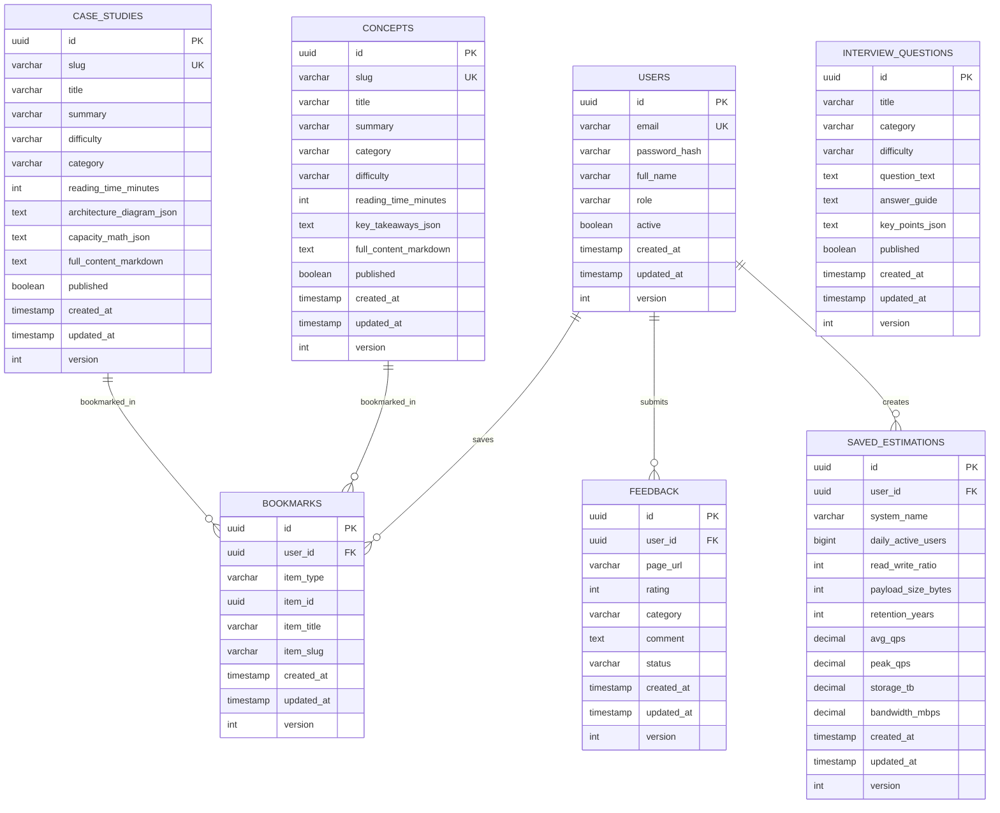

# Data Model & ERD — System Design Lab

## 1. Entity-Relationship Diagram (Mermaid)

## 2. Table Specifications & DDL

### 2.1 `case_studies`
| Column | Type | Constraints | Description |
|---|---|---|---|
| `id` | UUID | PRIMARY KEY | Unique entity identifier |
| `slug` | VARCHAR(120) | UNIQUE, NOT NULL | Clean URL slug (e.g. `url-shortener`) |
| `title` | VARCHAR(255) | NOT NULL | Human-readable title |
| `summary` | VARCHAR(500) | NOT NULL | Meta description and preview text |
| `difficulty` | VARCHAR(32) | NOT NULL | `BEGINNER`, `INTERMEDIATE`, `ADVANCED` |
| `category` | VARCHAR(64) | NOT NULL | `HIGH_THROUGHPUT`, `STORAGE`, `REAL_TIME` |
| `reading_time_minutes` | INT | NOT NULL, DEFAULT 15 | Estimated reading duration |
| `architecture_diagram_json` | TEXT | NULL | Structured diagram nodes and edges |
| `capacity_math_json` | TEXT | NULL | JSON calculation inputs & outputs |
| `full_content_markdown` | TEXT | NOT NULL | Complete 24-step case study content |
| `published` | BOOLEAN | NOT NULL, DEFAULT TRUE | Visibility flag |
| `created_at` | TIMESTAMP WITH TIME ZONE | NOT NULL | Audit creation timestamp |
| `updated_at` | TIMESTAMP WITH TIME ZONE | NOT NULL | Audit update timestamp |
| `version` | INT | NOT NULL, DEFAULT 0 | Optimistic locking version |

**Indexes:**
- `idx_case_studies_slug` ON `case_studies (slug)`
- `idx_case_studies_category` ON `case_studies (category)`
- `idx_case_studies_difficulty` ON `case_studies (difficulty)`

### 2.2 `concepts`
| Column | Type | Constraints | Description |
|---|---|---|---|
| `id` | UUID | PRIMARY KEY | Unique entity identifier |
| `slug` | VARCHAR(120) | UNIQUE, NOT NULL | Concept slug (e.g. `hld-vs-lld`, `caching`) |
| `title` | VARCHAR(255) | NOT NULL | Topic title |
| `summary` | VARCHAR(500) | NOT NULL | SEO summary |
| `category` | VARCHAR(64) | NOT NULL | `FUNDAMENTALS`, `CACHING`, `DATABASES`, `SCALING` |
| `difficulty` | VARCHAR(32) | NOT NULL | Target audience level |
| `reading_time_minutes` | INT | NOT NULL, DEFAULT 10 | Reading time |
| `key_takeaways_json` | TEXT | NULL | Array of bulleted points |
| `full_content_markdown` | TEXT | NOT NULL | In-depth concept body |
| `published` | BOOLEAN | NOT NULL, DEFAULT TRUE | Visibility flag |
| `created_at` | TIMESTAMP WITH TIME ZONE | NOT NULL | Creation timestamp |
| `updated_at` | TIMESTAMP WITH TIME ZONE | NOT NULL | Update timestamp |
| `version` | INT | NOT NULL, DEFAULT 0 | Optimistic locking version |

**Indexes:**
- `idx_concepts_slug` ON `concepts (slug)`
- `idx_concepts_category` ON `concepts (category)`

### 2.3 `interview_questions`
| Column | Type | Constraints | Description |
|---|---|---|---|
| `id` | UUID | PRIMARY KEY | Unique identifier |
| `title` | VARCHAR(255) | NOT NULL | Question header |
| `category` | VARCHAR(64) | NOT NULL | `SYSTEM_DESIGN`, `CONCURRENCY`, `DATABASE` |
| `difficulty` | VARCHAR(32) | NOT NULL | `BEGINNER`, `INTERMEDIATE`, `HARD` |
| `question_text` | TEXT | NOT NULL | The interview problem prompt |
| `answer_guide` | TEXT | NOT NULL | Structured candidate walkthrough |
| `key_points_json` | TEXT | NULL | JSON array of checklist evaluation criteria |
| `published` | BOOLEAN | NOT NULL, DEFAULT TRUE | Active question flag |
| `created_at` | TIMESTAMP WITH TIME ZONE | NOT NULL | Creation timestamp |
| `updated_at` | TIMESTAMP WITH TIME ZONE | NOT NULL | Update timestamp |
| `version` | INT | NOT NULL, DEFAULT 0 | Optimistic lock version |

### 2.4 `users`
| Column | Type | Constraints | Description |
|---|---|---|---|
| `id` | UUID | PRIMARY KEY | Unique user ID |
| `email` | VARCHAR(255) | UNIQUE, NOT NULL | Account email |
| `password_hash` | VARCHAR(255) | NOT NULL | BCrypt hash (strength 12) |
| `full_name` | VARCHAR(120) | NOT NULL | User's display name |
| `role` | VARCHAR(32) | NOT NULL, DEFAULT 'ROLE_STUDENT' | `ROLE_STUDENT`, `ROLE_ADMIN` |
| `active` | BOOLEAN | NOT NULL, DEFAULT TRUE | Account status |
| `created_at` | TIMESTAMP WITH TIME ZONE | NOT NULL | Created date |
| `updated_at` | TIMESTAMP WITH TIME ZONE | NOT NULL | Updated date |
| `version` | INT | NOT NULL, DEFAULT 0 | Optimistic locking |

### 2.5 `bookmarks`
| Column | Type | Constraints | Description |
|---|---|---|---|
| `id` | UUID | PRIMARY KEY | Bookmark ID |
| `user_id` | UUID | NOT NULL, FK -> users(id) | Owning user |
| `item_type` | VARCHAR(32) | NOT NULL | `CASE_STUDY`, `CONCEPT`, `INTERVIEW` |
| `item_id` | UUID | NOT NULL | Referent entity ID |
| `item_title` | VARCHAR(255) | NOT NULL | Title snapshot |
| `item_slug` | VARCHAR(120) | NOT NULL | Slug snapshot |
| `created_at` | TIMESTAMP WITH TIME ZONE | NOT NULL | Creation date |
| `updated_at` | TIMESTAMP WITH TIME ZONE | NOT NULL | Update date |
| `version` | INT | NOT NULL, DEFAULT 0 | Optimistic locking |

**Constraints & Indexes:**
- UNIQUE (`user_id`, `item_type`, `item_id`)
- `idx_bookmarks_user_id` ON `bookmarks (user_id)`

### 2.6 `saved_estimations`
| Column | Type | Constraints | Description |
|---|---|---|---|
| `id` | UUID | PRIMARY KEY | Estimation record ID |
| `user_id` | UUID | NULL, FK -> users(id) | Nullable for anonymous session saves |
| `system_name` | VARCHAR(120) | NOT NULL | E.g., "TinyURL Scaling Calculation" |
| `daily_active_users` | BIGINT | NOT NULL | User DAU input |
| `read_write_ratio` | INT | NOT NULL | E.g., 10 (10:1) |
| `payload_size_bytes` | INT | NOT NULL | E.g., 500 bytes |
| `retention_years` | INT | NOT NULL | E.g., 5 years |
| `avg_qps` | NUMERIC(14,2) | NOT NULL | Computed QPS |
| `peak_qps` | NUMERIC(14,2) | NOT NULL | Computed peak QPS |
| `storage_tb` | NUMERIC(14,3) | NOT NULL | Computed storage required (TB) |
| `bandwidth_mbps` | NUMERIC(14,2) | NOT NULL | Computed bandwidth (Mbps) |
| `created_at` | TIMESTAMP WITH TIME ZONE | NOT NULL | Creation date |
| `updated_at` | TIMESTAMP WITH TIME ZONE | NOT NULL | Update date |
| `version` | INT | NOT NULL, DEFAULT 0 | Versioning |

### 2.7 `feedback`
| Column | Type | Constraints | Description |
|---|---|---|---|
| `id` | UUID | PRIMARY KEY | Feedback identifier |
| `user_id` | UUID | NULL, FK -> users(id) | Submitter (optional) |
| `page_url` | VARCHAR(255) | NOT NULL | Target page URL |
| `rating` | INT | NOT NULL | Rating 1 to 5 |
| `category` | VARCHAR(64) | NOT NULL | `CONTENT_CLARITY`, `DIAGRAM`, `CALCULATOR`, `OTHER` |
| `comment` | TEXT | NULL | User text remarks |
| `status` | VARCHAR(32) | NOT NULL, DEFAULT 'NEW' | `NEW`, `REVIEWED`, `RESOLVED` |
| `created_at` | TIMESTAMP WITH TIME ZONE | NOT NULL | Creation date |
| `updated_at` | TIMESTAMP WITH TIME ZONE | NOT NULL | Update date |
| `version` | INT | NOT NULL, DEFAULT 0 | Versioning |
