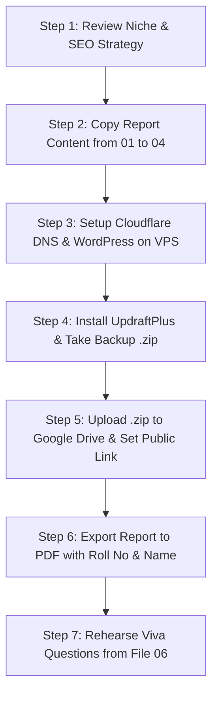

# Milestone I: Research, Strategy & Cloud Deployment (20 Marks)
## Master Action Plan & Executive Checklist
**Course Code:** CSET489 — Search Engine Optimization & Web Strategies  
**Project:** System Design Lab (Interactive Architecture & Interview Platform)  
**Submission Filename:** `CSET489_SEO_Assignment_[RollNo]_[YourName].pdf`  

---

## 🎯 Scoring Breakdown & Deliverables Matrix

| Section | Milestone I Requirement | Marks | Target File in `/milestone/` | Status |
|---|---|:---:|---|:---:|
| **Part 1** | Niche, Target Audience & SEO Problem Identification | **2** | [`01_NICHE_AUDIENCE_AND_SEO_PROBLEM.md`](./01_NICHE_AUDIENCE_AND_SEO_PROBLEM.md) | Ready |
| **Part 2** | Keyword Research, LSI & Search Intent Mapping | **2** | [`02_KEYWORD_RESEARCH_LSI_INTENT_MAP.md`](./02_KEYWORD_RESEARCH_LSI_INTENT_MAP.md) | Ready |
| **Part 3** | Competitor Analysis & SERP Breakdown | **4** | [`03_COMPETITOR_ANALYSIS_AND_SERP_BREAKDOWN.md`](./03_COMPETITOR_ANALYSIS_AND_SERP_BREAKDOWN.md) | Ready |
| **Part 4** | Project Design & SEO Implementation Roadmap | **4** | [`04_PROJECT_DESIGN_AND_SEO_ROADMAP.md`](./04_PROJECT_DESIGN_AND_SEO_ROADMAP.md) | Ready |
| **Part 5** | VPS Setup, Cloudflare DNS, SSL & Functional WordPress Deployment | **4** | [`05_VPS_CLOUDFLARE_SSL_WORDPRESS_DEPLOYMENT_GUIDE.md`](./05_VPS_CLOUDFLARE_SSL_WORDPRESS_DEPLOYMENT_GUIDE.md) | Step-by-Step |
| **Part 6** | Final Documentation, Backup Link & Viva Defense | **4** | [`06_FINAL_REPORT_TEMPLATE_AND_VIVA_DEFENSE.md`](./06_FINAL_REPORT_TEMPLATE_AND_VIVA_DEFENSE.md) | Ready |
| **TOTAL** | **Milestone I Evaluation Score** | **20** | Full Package Ready | ✅ |

---

## 📋 Mandatory Submission Package Checklist

According to the university evaluation guidelines, you must submit:
1. **Report File:** Single structured PDF or DOCX report named:
   `CSET489_SEO_Assignment_[RollNo]_[YourName].pdf` (e.g., `CSET489_SEO_Assignment_21BCS101_Deepanshu.pdf`)
2. **Live Website URL:**
   - Primary Custom App: `https://system-design-lab-topaz.vercel.app`
   - Content/WordPress Hub: `https://yourdomain.com` (or your Cloudflare/VPS URL)
3. **UpdraftPlus Backup Public Link:**
   - Public Google Drive Link (`Anyone with the link can view/download`) containing the full `.zip` backup archive generated by UpdraftPlus.
4. **Live Viva & Demonstration:**
   - 5-minute confident walkthrough of the live site, architectural choices, and defense of keyword/SERP strategies.

---

## 🗺️ How the Project Strategy Works (The "Two-Engine" Model)

The professor's syllabus requires a **WordPress Deployment with UpdraftPlus backup**, while you have built a state-of-the-art **Full-Stack Next.js 14 + Spring Boot platform (System Design Lab)**. 

We present the project using the industry standard **Two-Engine Architecture**:
1. **Engine 1: The Interactive App (System Design Lab)**
   - Custom Next.js 14 + Spring Boot 3 + PostgreSQL platform.
   - Hosts interactive tools (Capacity Calculator, Decision Matrix, Architecture Diagrams).
   - High user engagement, low bounce rate, high dwell time.
2. **Engine 2: The WordPress Editorial & Content Hub**
   - Deployed on a VPS behind Cloudflare CDN & SSL.
   - Hosts long-form SEO articles, case study breakdowns, tutorials, and lead magnets.
   - Backed up via UpdraftPlus (satisfying the 4-mark rubric requirement).
   - Drives organic top-of-funnel search traffic from Google to the interactive app via internal links!

This approach ensures **full marks across all technical requirements** while demonstrating high technical sophistication to the examiner.

---

## 🏃 Quick Execution Roadmap (Step-by-Step)

Proceed to the next document: [`01_NICHE_AUDIENCE_AND_SEO_PROBLEM.md`](./01_NICHE_AUDIENCE_AND_SEO_PROBLEM.md).
