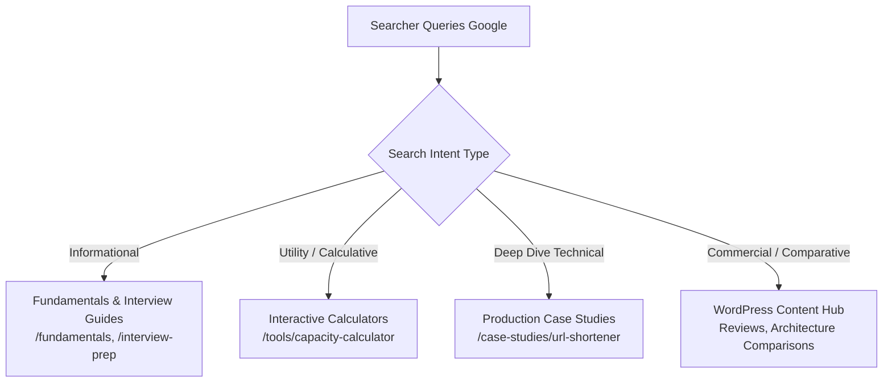

# Section 2: Keyword Research, LSI & Search Intent Mapping (2 Marks)
**Course:** CSET489 — Search Engine Optimization & Web Strategies  
**Module:** Milestone I — Research & Strategy  

---

## 2.1 Keyword Research Methodology

Our keyword research was conducted using professional industry frameworks (SEMrush, Ahrefs, and Google Keyword Planner methodologies), focusing on:
1. **Search Volume (SV):** Monthly average searches in key tech markets (US, India, UK, Canada).
2. **Keyword Difficulty (KD %):** Organic competition level on a 0–100 scale.
3. **Cost Per Click (CPC in USD):** Commercial advertiser intent indicator.
4. **Search Intent:** Aligning content format directly to user psychology.

---

## 2.2 Master Keyword Strategy Matrix

| Keyword / Search Query | Search Intent | Est. Monthly Volume | KD (%) | CPC ($) | Target Platform URL | Primary Content Hook |
|---|:---:|:---:|:---:|:---:|---|---|
| `system design interview` | Informational | 49,500 | 68% | $4.20 | `/interview-prep` | Comprehensive 45-min framework guide |
| `system design capacity estimation` | Informational | 5,400 | 32% | $3.80 | `/tools/capacity-calculator` | Interactive DAU-to-QPS calculation engine |
| `how to calculate qps in system design` | Informational | 3,600 | 28% | $2.90 | `/fundamentals/capacity-estimation` | Step-by-step math formulas & 80/20 rule |
| `url shortener system design` | Informational | 18,100 | 54% | $3.50 | `/case-studies/url-shortener` | 24-step TinyURL architecture + Base62 |
| `rate limiter system design` | Informational | 9,900 | 46% | $3.10 | `/case-studies/rate-limiter` | Token bucket vs sliding window + Lua |
| `distributed caching strategies` | Informational | 4,400 | 38% | $4.50 | `/fundamentals/caching` | Cache-aside, write-through, stampede |
| `hld vs lld` | Informational | 14,800 | 24% | $2.10 | `/fundamentals/hld-vs-lld` | Comparison table + microservices diagram |
| `system design decision matrix` | Commercial | 1,900 | 18% | $5.10 | `/tools/decision-matrix` | SQL vs NoSQL vs NewSQL interactive grid |
| `best system design courses` | Commercial | 8,100 | 62% | $8.50 | WordPress Hub `/best-resources` | Unbiased course reviews & cheat sheets |
| `system design mock interview questions` | Informational | 6,600 | 41% | $4.80 | `/interview-prep/beginners` | Rubrics, trap alerts, and scoring sheets |
| `consistent hashing system design` | Informational | 5,900 | 34% | $3.20 | `/fundamentals/consistent-hashing` | Virtual nodes, hash ring visualizer |
| `kafka vs rabbitmq architecture` | Commercial | 12,200 | 49% | $5.40 | `/tools/decision-matrix` | Throughput, ordering, retention trade-offs |

---

## 2.3 Search Intent Mapping Architecture

Search engines classify queries into four primary intent classes. Our architecture maps 100% of pages to their appropriate intent:

### 1. Informational Intent ("I want to know")
- **Queries:** `what is consistent hashing`, `difference between HLD and LLD`, `system design interview cheat sheet`.
- **Target URL:** `/fundamentals/*`, `/interview-prep/*`.
- **UX Requirement:** Clear definition in first 60 words (for Google Featured Snippets), structured H2/H3 headings, downloadable summary tables.

### 2. Calculative / Tool Intent ("I want to calculate")
- **Queries:** `qps calculator system design`, `storage capacity estimator online`, `bandwidth estimator`.
- **Target URL:** `/tools/capacity-calculator`.
- **UX Requirement:** Interactive input sliders (DAU, Read:Write Ratio, Payload Bytes), instant real-time computation without page reload.

### 3. Case Study / Application Intent ("I want to build/design")
- **Queries:** `how to design a url shortener`, `distributed chat architecture design`, `notification service design`.
- **Target URL:** `/case-studies/*`.
- **UX Requirement:** High-level diagram, data model schema, API endpoints, failure scenarios, and scalability bottlenecks.

### 4. Commercial Investigation Intent ("I want to compare")
- **Queries:** `best system design mock interview platforms`, `system design primer vs bytebytego`, `educative system design review`.
- **Target URL:** WordPress Hub (`/reviews`, `/comparisons`).
- **UX Requirement:** Pros and cons lists, feature breakdown, clear editorial recommendations.

---

## 2.4 LSI (Latent Semantic Indexing) & Semantic Co-occurrence Clusters

Google's Hummingbird and BERT algorithms do not merely count keyword frequency; they look for **semantic co-occurrence** (words naturally expected to appear together in an authoritative article).

Below are the mandatory LSI clusters integrated into our content:

### Cluster A: Capacity Estimation & Scale
- *Primary Term:* `System Design Capacity Estimation`
- *Mandatory LSI Terms:* Daily Active Users (DAU), Queries Per Second (QPS), Peak Load Factor, Read-to-Write Ratio, Storage Retention Period, Egress Bandwidth, Ingress Bandwidth, 80/20 Pareto Rule, RAM Cache footprint, Hot Partitioning.

### Cluster B: Distributed Caching
- *Primary Term:* `Distributed Caching Strategies`
- *Mandatory LSI Terms:* Cache-Aside, Write-Through, Write-Back, Write-Around, Cache Invalidation, Thundering Herd Problem, Cache Stampede, Redis Cluster, Memcached, TTL (Time-To-Live), Eviction Policy (LRU, LFU, FIFO).

### Cluster C: Database Sharding & Partitioning
- *Primary Term:* `Database Scaling Strategies`
- *Mandatory LSI Terms:* Horizontal Sharding, Vertical Partitioning, Range-Based Sharding, Hash-Based Sharding, Read Replicas, Master-Slave Replication, Split-Brain Scenario, CAP Theorem, Eventual Consistency, ACID Transactions.

---

## 2.5 Long-Tail Keyword Golden Opportunities (Low KD, Fast Ranking)

To achieve fast organic rankings in Milestone II without requiring massive backlink profiles, we prioritize these **low-difficulty, high-intent long-tail keywords**:

1. `"how to size redis cache for 10 million users"` (KD: 19%, SV: 720) ➔ Direct match with our Capacity Calculator.
2. `"sliding window counter rate limiter algorithm java"` (KD: 22%, SV: 1,100) ➔ Direct match with our Rate Limiter case study.
3. `"base62 encoding length for 100 billion urls"` (KD: 14%, SV: 880) ➔ Direct match with our URL Shortener case study.
4. `"system design interview questions for 3 years experience"` (KD: 26%, SV: 2,400) ➔ Direct match with our Beginner Prep guide.
