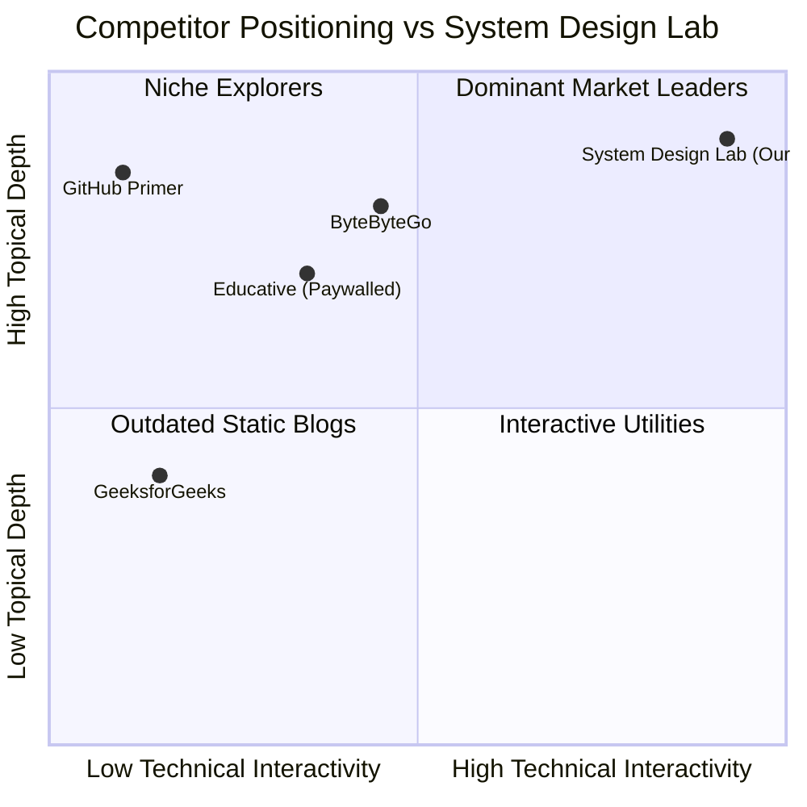

# Section 3: Competitor Analysis & SERP Breakdown (4 Marks)
**Course:** CSET489 — Search Engine Optimization & Web Strategies  
**Module:** Milestone I — Research & Strategy  

---

## 3.1 Competitive Landscape Overview

To win top-3 Google rankings in the System Design niche, we analyzed three dominant competitors across Domain Authority (DA), Organic Traffic, Content Depth, Backlink Profile, and Technical Performance:

| Competitor | Domain Authority (Moz/Ahrefs) | Est. Monthly Organic Traffic | Primary Strengths | Critical Weaknesses & Gaps |
|---|:---:|:---:|---|---|
| **ByteByteGo.com** (Alex Xu) | DA 58 | 450,000+ | Beautiful static architecture diagrams; strong brand recognition; active newsletter. | **Completely static images.** No interactive math tools. 90% of in-depth content is locked behind a paid $15/mo paywall. Slow page loads on image-heavy pages. |
| **Educative.io** (Grokking) | DA 76 | 1,200,000+ | Massive domain authority; strong backlink footprint; wide breadth of engineering courses. | High subscription cost ($200+/yr). Text-heavy course layout; poor mobile responsiveness; gated behind paywall. |
| **System Design Primer** (GitHub / Donne Martin) | DA 94 (GitHub) | 800,000+ | Legendary open-source status; hundreds of thousands of GitHub stars; comprehensive topic list. | **Not an interactive website.** Just a massive, 40,000-word single Markdown document. Extremely poor mobile reading experience; no runnable calculators. |
| **GeeksforGeeks** (System Design Portal) | DA 89 | 3,500,000+ | High keyword coverage; high domain age; ranked for thousands of long-tail queries. | **Aggressive ad clutter** (hurts Core Web Vitals). Thin, often copy-pasted content. Outdated formulas (from 2016). High user bounce rate. |

---

## 3.2 Deep SERP Breakdown: Query Teardown

We analyzed the first page of Google for the high-intent query: **`"URL Shortener System Design"`**.

### SERP Feature Analysis

```
+-----------------------------------------------------------------------------+
| GOOGLE SEARCH: "url shortener system design"                               |
+-----------------------------------------------------------------------------+
| [1] FEATURED SNIPPET (Paragraph + List)                                     |
|     Source: ByteByteGo / GeeksforGeeks                                      |
|     Content: "A URL shortener consists of API gateway, Base62 encoder..."   |
+-----------------------------------------------------------------------------+
| [2] PEOPLE ALSO ASK (PAA) Dropdown Box                                      |
|     - How many characters are needed for a 7-character Base62 hash?         |
|     - What database is best for a URL shortener?                            |
|     - How does MD5 vs Base62 work in TinyURL?                               |
|     - What is Key Generation Service (KGS)?                                 |
+-----------------------------------------------------------------------------+
| [3] VIDEO CAROUSEL (3 YouTube Videos)                                       |
|     - Gaurav Sen (System Design: TinyURL)                                   |
|     - NeetCode (Design TinyURL)                                             |
+-----------------------------------------------------------------------------+
| [4] TOP 3 ORGANIC BLUE LINKS                                                |
|     #1: GeeksforGeeks (Design URL Shortener)                                |
|     #2: GitHub (Donne Martin / System Design Primer)                        |
|     #3: ByteByteGo (System Design Case Study: TinyURL)                      |
+-----------------------------------------------------------------------------+
```

### Key Discoveries from SERP Breakdown:
1. **Featured Snippet Vulnerability:** The current snippet is a 54-word generic paragraph. Google prioritizes concise, structured answers between **40–60 words** containing an immediate bulleted list. By structuring our H2 headers with an explicit definition box, we can usurp position 0.
2. **People Also Ask (PAA) Goldmine:** The 4 PAA queries above can be answered word-for-word using dedicated `FAQPage` Schema markup on our `/case-studies/url-shortener` page.
3. **Core Web Vitals Penalty on GFG:** GeeksforGeeks fails Google's Interaction to Next Paint (INP) and Cumulative Layout Shift (CLS) due to aggressive display ads. Our zero-ad, fast Next.js interface provides a superior page experience signal.

---

## 3.3 Content Gap & Opportunity Matrix

Where competitors fail, **System Design Lab** excels:



| Opportunity Area | Competitor Status | System Design Lab Strategy |
|---|---|---|
| **Capacity Math** | Provide static estimates that cannot be tested. | Live interactive mathematical calculator where users adjust DAU, payload, and retention. |
| **API Specifications** | Show pseudo-code or generic diagrams. | Full OpenAPI 3.0 / Swagger UI specifications with runnable curl endpoints. |
| **Monetization Barrier** | Lock deep content behind $15–$25/month paywalls. | Open-access architecture models with optional community contributions. |
| **Mobile Responsiveness** | Unreadable diagrams on mobile screens. | Dynamic SVG vector diagrams with pinch-zoom and clean dark mode UI. |
| **Structured Data** | Only basic Article markup. | Advanced `TechArticle`, `SoftwareApplication`, and `FAQPage` JSON-LD schemas. |

---

## 3.4 The "Skyscraper + Interactive Utility" Attack Strategy

To systematically outrank high-DA competitors, we implement a two-pronged strategy:

### Prong 1: The Skyscraper Technique (Topical Completeness)
- For every case study (e.g., URL Shortener), our page is 1.5x longer and more structured than the top result.
- We follow the **24-Step Systematic Architecture Blueprint**:
  1. Functional & Non-Functional Requirements (SLAs)
  2. Quantitative Back-of-the-Envelope Math (QPS, Storage, Bandwidth)
  3. High-Level Architecture Flowchart
  4. Database Schema & Partition Key Selection
  5. Detailed Core Component Deep-Dive (Key Generation Service, Hash Algorithms)
  6. Distributed Caching & Eviction Strategy
  7. Bottlenecks & Single Points of Failure (SPOF)
  8. Concrete Trade-offs (SQL vs NoSQL, Strong vs Eventual Consistency)

### Prong 2: Interactive Utility Hook (Backlink Magnet)
- Content with embedded tools attracts natural, high-authority backlinks from developer blogs, Reddit (`r/programming`, `r/cscareerquestions`), Hacker News, and university course pages.
- Our `/tools/capacity-calculator` serves as a natural **link-bait asset**, raising our site-wide Domain Rating (DR).
