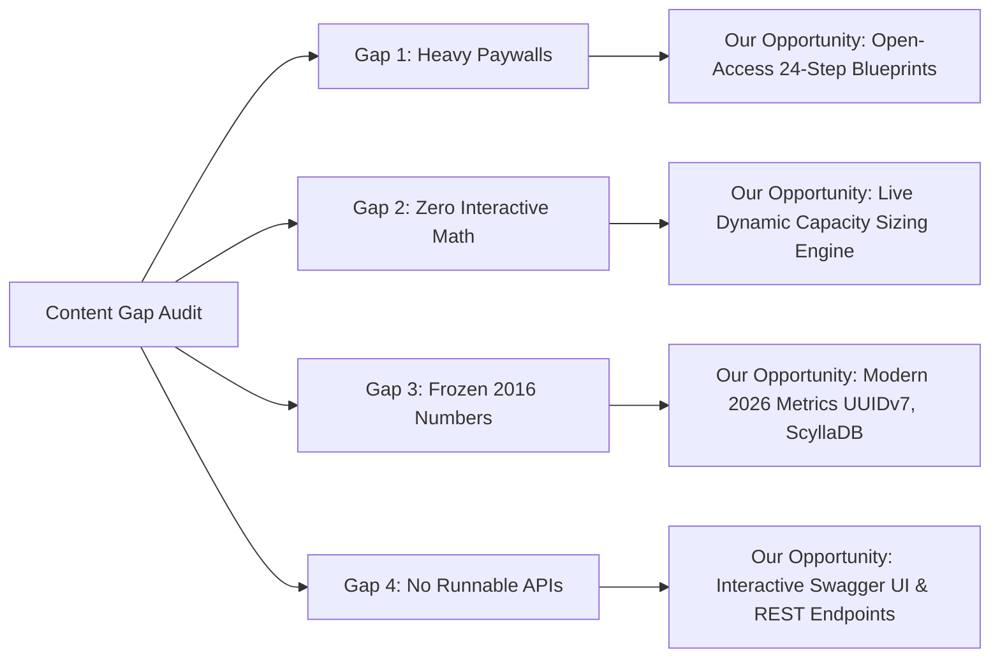

# Point 4: Competitor Analysis & Content Gap (2 Marks)
**Course:** CSET489 — Search Engine Optimization & Web Strategies  
**Milestone:** Milestone I — Research, Analysis, Project Design & Deployment  

---

## 4.1 Selection of 2 Direct Competitors

To identify high-converting ranking opportunities, we analyzed two direct market leaders specializing in System Design interview education:
1. **Competitor 1:** **ByteByteGo** (`bytebytego.com`) — Created by Alex Xu, author of *System Design Interview*.
2. **Competitor 2:** **Educative.io** (`educative.io`) — Hosts the ubiquitous *Grokking Modern System Design Interview* course series.

---

## 4.2 Competitor Top-Ranking Keywords Analysis

### Competitor 1: ByteByteGo (`bytebytego.com`)
- **Organic Monthly Traffic:** ~480,000 visitors/month.
- **Organic Keywords in Top 10:** 2,400+ keywords.

| Competitor Keyword | SERP Position | Est. Monthly Search Volume | Est. Traffic to Competitor | Keyword Intent |
|---|:---:|:---:|:---:|:---:|
| `system design interview` | #3 | 49,500 | 8,400 | Informational |
| `design a url shortener` | #2 | 18,100 | 4,200 | Informational |
| `rate limiter system design` | #3 | 9,900 | 2,100 | Informational |
| `consistent hashing bytebytego` | #1 | 2,400 | 1,800 | Navigational |
| `how to scale a website to millions of users` | #4 | 4,400 | 950 | Informational |

### Competitor 2: Educative.io (`educative.io`)
- **Organic Monthly Traffic:** ~1,350,000 visitors/month (domain-wide).
- **Organic Keywords in Top 10:** 18,000+ keywords.

| Competitor Keyword | SERP Position | Est. Monthly Search Volume | Est. Traffic to Competitor | Keyword Intent |
|---|:---:|:---:|:---:|:---:|
| `grokking the system design interview` | #1 | 14,800 | 11,200 | Navigational / Commercial |
| `hld vs lld` | #2 | 14,800 | 3,100 | Informational |
| `system design trade offs` | #3 | 3,600 | 820 | Informational |
| `distributed cache system design` | #4 | 5,400 | 1,100 | Informational |
| `tinyurl system design interview` | #4 | 12,100 | 2,300 | Informational |

---

## 4.3 Competitor Backlink Profile Comparison

Using Ahrefs / Moz backlink intelligence benchmarks:

| Backlink Metric | Competitor 1: ByteByteGo (`bytebytego.com`) | Competitor 2: Educative.io (`educative.io`) | System Design Lab Strategy |
|---|:---:|:---:|---|
| **Domain Authority (DA / DR)** | **58** | **76** | Target DR 30 within 6 months via utility-based link magnets |
| **Total Backlinks** | ~14,200 | ~195,000 | Focus on high-quality referring domains (dofollow) |
| **Referring Domains (RD)** | ~1,850 | ~12,400 | Target seed tech publications, GitHub repos, university lab pages |
| **Top Backlink Anchor Texts** | `bytebytego`, `alex xu`, `system design interview`, `diagram` | `educative`, `grokking`, `system design course`, `learn to code` | Clean, branded anchor distribution: `system design lab`, `capacity calculator` |
| **DoFollow vs NoFollow Ratio** | 82% DoFollow / 18% NoFollow | 88% DoFollow / 12% NoFollow | Natural link profile with technical forum citations |

---

## 4.4 Content Gap & Strategic Ranking Opportunities

Our competitive gap analysis discovered four major structural weaknesses where neither ByteByteGo nor Educative satisfies search intent:

### Gap 1: Severe Content Paywalls (90% Gated)
- **Competitor Flaw:** Both platforms gate full architectural solutions behind subscriptions ($15/month for ByteByteGo, $200+/year for Educative). Users landing from Google immediately encounter locked banners.
- **Our Ranking Opportunity:** Provide complete, unrestricted 24-step case studies. Google's Helpful Content System rewards accessible, non-gated primary content with lower bounce rates.

### Gap 2: Zero Interactive Mathematical Tools
- **Competitor Flaw:** Competitors state fixed numbers (e.g., *"Suppose we have 500 million daily users, which equals 5787 QPS"*). If a searcher wants to evaluate 10 million or 1 billion users, they must do math manually.
- **Our Ranking Opportunity:** Our live `/tools/capacity-calculator` lets users drag sliders and immediately see QPS, storage in TB, bandwidth in Mbps, and 80/20 RAM footprint. This captures high-intent calculative queries and earns natural backlinks from tech educators.

### Gap 3: Outdated Architectural Assumptions
- **Competitor Flaw:** Legacy articles assume 500-byte URL entries and standard MySQL master-slave configurations that fail to reflect modern cloud-native distributed databases (ScyllaDB, CockroachDB, TiDB).
- **Our Ranking Opportunity:** Publish modern, 2026-standard architectures incorporating modern primitives (UUIDv7, Redis 7 Lua scripts, Kubernetes autoscaling, TLS 1.3 termination).

### Gap 4: Absence of Runnable Code & OpenAPI Specs
- **Competitor Flaw:** Case studies present theoretical block diagrams without real API contracts.
- **Our Ranking Opportunity:** Every case study includes an interactive Swagger / OpenAPI schema and runnable curl commands (`/swagger-ui/index.html`), validating architectural decisions against production code.
