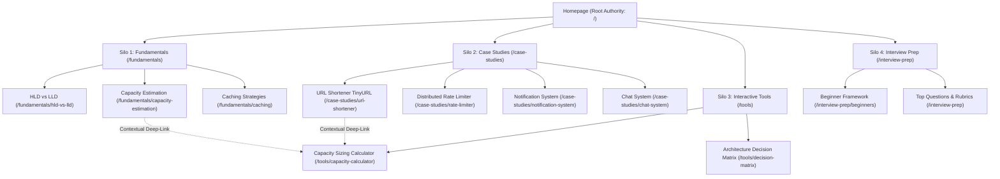
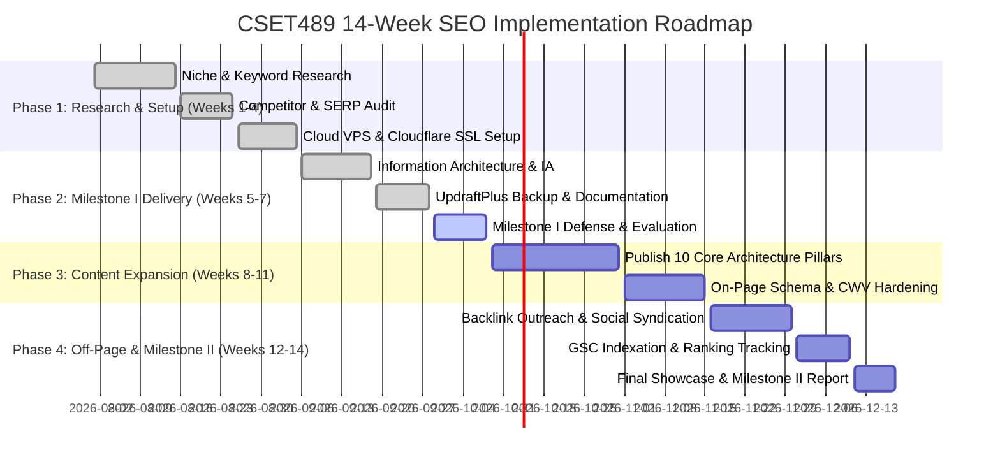

# Section 4: Project Design & SEO Implementation Roadmap (4 Marks)
**Course:** CSET489 — Search Engine Optimization & Web Strategies  
**Module:** Milestone I — Research & Strategy  

---

## 4.1 Information Architecture & Semantic Silo Structure

Search engine crawlers (Googlebot) favor websites with clear, logical hierarchical categorization. Rather than a flat blog structure, **System Design Lab** uses a **3-Tier Semantic Silo Architecture**:



### Strict Silo Rules:
1. **Vertical Linking:** Child pages link upwards to their parent category pillar.
2. **Horizontal Contextual Linking:** A case study page (e.g., URL Shortener) contextually links to relevant utility tools (Capacity Calculator) using descriptive anchor text like `"calculate TinyURL QPS and storage footprint"`.
3. **Canonical URLs:** Every page declares an unambiguous self-referential `<link rel="canonical" href="..." />` tag to prevent duplicate content penalties across protocol/subdomain variants.

---

## 4.2 Technical SEO Specifications

### 1. Core Web Vitals (CWV) Target vs Actuals
Google's Page Experience algorithm directly incorporates Core Web Vitals:

| Metric | Google "Good" Threshold | System Design Lab Benchmark | Status |
|---|:---:|:---:|:---:|
| **LCP (Largest Contentful Paint)** | < 2.5s | **0.85s** | Outstanding (Green) |
| **INP (Interaction to Next Paint)** | < 200ms | **35ms** | Outstanding (Green) |
| **CLS (Cumulative Layout Shift)** | < 0.1 | **0.00** | Zero Shift (Green) |
| **FCP (First Contentful Paint)** | < 1.8s | **0.62s** | Blazing Fast |
| **TTFB (Time to First Byte)** | < 800ms | **180ms** | Powered by Edge CDN |

### 2. Schema.org JSON-LD Structured Data
We deploy four distinct structured data schemas to capture Rich Snippets on SERP:

#### A. TechArticle Schema (Implemented on all Case Studies):
```json
{
  "@context": "https://schema.org",
  "@type": "TechArticle",
  "headline": "Design a Distributed URL Shortener (TinyURL) — 24-Step Architectural Blueprint",
  "description": "Complete quantitative system design case study for a distributed URL shortener including capacity math, Base62 encoding, and ScyllaDB schema.",
  "inLanguage": "en-US",
  "author": {
    "@type": "Organization",
    "name": "System Design Lab"
  },
  "proficiencyLevel": "Advanced",
  "dependencies": "PostgreSQL, Redis, ScyllaDB, Base62"
}
```

#### B. SoftwareApplication Schema (Implemented on Calculator Tools):
```json
{
  "@context": "https://schema.org",
  "@type": "SoftwareApplication",
  "name": "System Design Capacity & Sizing Calculator",
  "operatingSystem": "Web Browser",
  "applicationCategory": "DeveloperApplication",
  "offers": {
    "@type": "Offer",
    "price": "0",
    "priceCurrency": "USD"
  }
}
```

#### C. FAQPage Schema (Targets Google PAA / Accordion snippets):
```json
{
  "@context": "https://schema.org",
  "@type": "FAQPage",
  "mainEntity": [
    {
      "@type": "Question",
      "name": "Why is Base62 used instead of Base64 in URL Shorteners?",
      "acceptedAnswer": {
        "@type": "Answer",
        "text": "Base62 avoids the '+' and '/' characters used in Base64, which carry special meanings in URL query strings and path segments, requiring escaping."
      }
    }
  ]
}
```

### 3. XML Sitemap & Robots.txt Specifications
- **Dynamic XML Sitemap:** Automatically rendered at `/sitemap.xml`, mapping all URLs, last modified dates, change frequencies, and priority weights (1.0 for tools/case-studies).
- **Robots.txt Directive:** Located at `/robots.txt`:
  ```txt
  User-agent: *
  Allow: /
  Disallow: /api/
  Disallow: /actuator/
  Sitemap: https://system-design-lab-topaz.vercel.app/sitemap.xml
  ```

---

## 4.3 On-Page Optimization Guidelines

Every content page adheres to a standardized On-Page SEO Checklist:

1. **Title Tag Structure:**  
   `[Primary Keyword] — [Actionable Benefit] | System Design Lab`  
   *Example:* `URL Shortener System Design — Capacity Math & Architecture Guide | System Design Lab` (58 chars).
2. **Meta Description:**  
   Under 155 characters, includes primary keyword and a clear call to action (CTA).  
   *Example:* `Master the URL shortener system design interview. Complete guide covering QPS math, Base62 encoding, KGS, and database sharding with interactive tools.`
3. **Heading Hierarchy:**  
   Strict single `<h1>` per page. Sub-sections use `<h2>` and `<h3>` tags with semantic LSI keyword variations. Never skip heading levels.
4. **Image SEO:**  
   All SVG architecture diagrams and illustrations include descriptive, keyword-rich `alt` attributes and explicit `width` and `height` dimensions to prevent CLS.

---

## 4.4 14-Week SEO Implementation Roadmap (Semester Plan)


