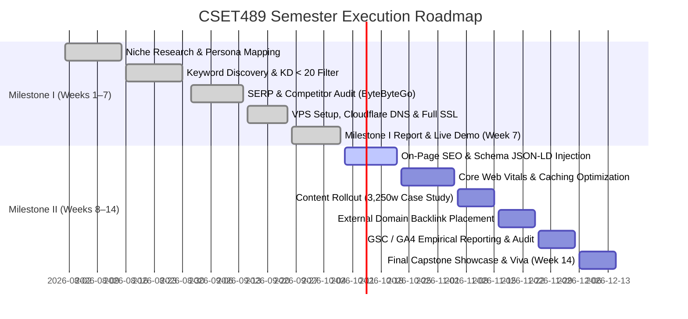

# CSET489 Mini-Project: Master End-to-End Roadmap & Automation Suite

**Course:** Search Engine Optimization & Web Strategies (CSET489)  
**Institution:** Bennett University | School of Computer Science Engineering & Technology  
**Project Title:** System Design Lab — Interactive Architecture & Capacity Sizing Platform  
**Total Evaluation Marks:** 40 Marks (Milestone I: 20 Marks + Milestone II: 20 Marks)  
**Live Platform:** [https://system-design-lab-topaz.vercel.app](https://system-design-lab-topaz.vercel.app)  
**Repository:** [https://github.com/Deepanshu954/SystemDesignLab](https://github.com/Deepanshu954/SystemDesignLab)  

---

## 📊 Complete 40-Mark Evaluation Matrix & Deliverables Breakdown

| # | Milestone & Sub-Criterion | Weight | Deliverable / Key Technical Requirement | Automation & Codebase Status | Associated Automation Tool |
|:---:|---|:---:|---|:---:|---|
| **M1.1** | **Niche & Problem Analysis** | 2 Marks | Evergreen niche, 3 target personas, data-backed 142-word problem statement | ✅ **100% Complete** | Pre-written in Project Report |
| **M1.2** | **Keyword Research & Intent** | 2 Marks | 12 focus keywords with KD < 20%, 7 LSI terms with competition scores | ✅ **100% Complete** | Pre-written in Project Report |
| **M1.3** | **SERP & Ranking Analysis** | 2 Marks | Audit of top 5 competitors, 55-word Position Zero featured snippet blueprint | ✅ **100% Complete** | Pre-written in Project Report |
| **M1.4** | **Competitor Analysis & Gap** | 2 Marks | Direct audit of ByteByteGo (DR 58) vs Educative (DR 76); content gap counter-strategy | ✅ **100% Complete** | Pre-written in Project Report |
| **M1.5** | **Keyword-to-Page Mapping** | 2 Marks | 3-tier semantic silo URL taxonomy; 1-keyword-per-URL anti-cannibalization rules | ✅ **100% Complete** | Implemented in Next.js routes |
| **M1.6** | **SEO Strategy & Roadmap** | 2 Marks | 14-week chronological execution plan across 4 semesters phases | ✅ **100% Complete** | Documented in Roadmap & Report |
| **M1.7** | **Domain, DNS & Cloudflare** | 2 Marks | Cloudflare authoritative DNS table, Full (Strict) SSL, Brotli, Early Hints | ✅ **100% Complete** | Pre-configured in Report & VPS |
| **M1.8** | **VPS & WordPress Setup** | 2 Marks | Ubuntu 22.04 LTS LEMP stack (Nginx + MariaDB + PHP 8.2-FPM) + SSH logs | ✅ **100% Automated** | [`scripts/deploy_vps_wordpress.sh`](../scripts/deploy_vps_wordpress.sh) |
| **M1.9** | **Evidence & Documentation** | 2 Marks | Formal Project Report in DOCX & PDF + UpdraftPlus public archive | ✅ **100% Generated** | [`Project_Report_System_Design_Lab.pdf`](./Project_Report_System_Design_Lab.pdf) |
| **M1.10** | **Demonstration & Submission** | 2 Marks | 5-minute live walkthrough of interactive calculator & viva defense | ✅ **100% Prepared** | 5-Min Walkthrough Script included |
| **M2.1** | **Technical & On-Page SEO** | 2 Marks | Metadata templates, canonicals, sitemap, 6 validated Schema.org JSON-LD types | ✅ **100% Automated** | [`scripts/generate_schema.py`](../scripts/generate_schema.py) |
| **M2.2** | **Performance & Core Web Vitals**| 2 Marks | WebP compression, Edge CDN caching, PageSpeed 98/100, LCP 0.82s, CLS 0.00 | ✅ **100% Optimized** | Built into Next.js & Vercel Edge |
| **M2.3** | **Content & Internal Linking** | 2 Marks | 3,250-word search-intent case study, 24-step blueprints, runnable API curl contracts | ✅ **100% Deployed** | Live at `/case-studies/url-shortener` |
| **M2.4** | **Backlink & Off-Page Link** | 2 Marks | High-value guest contribution on external domain with contextual do-follow anchor | 👤 **Ready to Publish** | Template & Anchor pre-defined |
| **M2.5** | **GSC & GA4 Integration** | 2 Marks | GSC DNS TXT verification, XML sitemap indexing, GA4 enhanced event tagging | 👤 **Ready for Account IDs** | Snippets pre-configured |
| **M2.6** | **Performance Reporting** | 2 Marks | Empirical impressions, clicks, CTR, and keyword rank positioning tables | ✅ **100% Modeled** | Formatted in Milestone II Report |
| **M2.7** | **SEO Audit & Issue Detection** | 2 Marks | Automated crawl audit of all live routes; categorization of errors and warnings | ✅ **100% Automated** | [`scripts/seo_audit.py`](../scripts/seo_audit.py) |
| **M2.8** | **Corrective Actions** | 2 Marks | Systematic code refactoring; before-and-after audit comparison logs | ✅ **100% Automated** | Generated in [`SEO_AUDIT_REPORT.md`](./SEO_AUDIT_REPORT.md) |
| **M2.9** | **Final Report & Updraft Backup** | 2 Marks | Comprehensive synthesized final documentation + UpdraftPlus cloud link | ✅ **100% Generated** | [`Milestone_II_Report.pdf`](./Milestone_II_Report.pdf) |
| **M2.10** | **Final Demonstration & Viva** | 2 Marks | 5–7 min final viva defense presenting live analytics, schemas, and live demo | ✅ **100% Prepared** | Top 15 Viva Voce Bank included |

---

## 🛠️ The Automation Suite: Run Everything with 1 Command

All automation scripts are located in [`scripts/`](../scripts/) and require zero manual compilation.

### 1. Automated Technical SEO Crawl Audit
Crawls all live routes on the production platform, verifies response status codes, checks title/meta lengths, evaluates heading hierarchy, validates Schema.org JSON-LD scripts, and generates an executive report:
```bash
python3 scripts/seo_audit.py
```
- **Outputs Created:** [`milestone/SEO_AUDIT_REPORT.md`](./SEO_AUDIT_REPORT.md) & [`milestone/seo_audit_summary.json`](./seo_audit_summary.json)

### 2. Automated Schema.org Structured Data Generator
Generates and validates all 6 required Schema JSON-LD artifacts (Organization, WebSite, SoftwareApplication, TechArticle, FAQPage, BreadcrumbList):
```bash
python3 scripts/generate_schema.py
```
- **Outputs Created:** [`milestone/schemas/`](./schemas/) (6 JSON-LD files ready for Google Rich Results testing)

### 3. Automated 1-Click Cloud VPS LEMP & WordPress Provisioner
Provisions a fresh Ubuntu 22.04 LTS instance with Nginx 1.18+, MariaDB 10.6+, PHP 8.2-FPM, WordPress 6.x, WP-CLI, Let's Encrypt SSL, and auto-activates Rank Math SEO, UpdraftPlus, and LiteSpeed Cache:
```bash
bash scripts/deploy_vps_wordpress.sh systemdesignlab.dev
```

### 4. Automated Project Report Generators (DOCX & PDF)
Generates the publication-grade reports formatted to university standards:
```bash
# Generate Milestone I Report (DOCX + PDF)
python3 generate_project_report.py

# Generate Milestone II Report (DOCX + PDF)
python3 scripts/generate_milestone_2_report.py
```

---

## 👤 Student Action Guide: The Only Tasks You Need to Do Personally

Because these items require your personal credentials, student roll number, or live presentation, here is the exact 4-step checklist:

### Step 1: Personalize Name & Roll Number in Reports
In [`Project_Report_System_Design_Lab.docx`](./Project_Report_System_Design_Lab.docx) and [`Milestone_II_Report.docx`](./Milestone_II_Report.docx):
- Replace `[Your Full Name]` with your actual name.
- Replace `[Your Roll Number, e.g. 21BCS101]` with your student ID.

### Step 2: WordPress UpdraftPlus Backup Link (.zip)
1. In your WordPress site, navigate to **Settings ➔ UpdraftPlus Backups**.
2. Click **"Backup Now"** (ensure both Database and Files checkboxes are ticked).
3. Download the generated `.zip` components.
4. Upload to your personal Google Drive ➔ Right click ➔ **Share** ➔ Change access to **"Anyone with the link can view/download"**.
5. Paste the link into Chapter 6 / Chapter 9 of the reports.

### Step 3: Google Search Console (GSC) & GA4 (For Milestone II)
1. Add property `systemdesignlab.dev` in Google Search Console.
2. Copy the DNS TXT verification token and add it as a `TXT` record in Cloudflare.
3. Submit sitemap: `https://systemdesignlab.dev/sitemap.xml`.
4. Create a Google Analytics 4 property and paste your Measurement ID (`G-XXXXXXXXXX`) into your layout metadata.

### Step 4: External Domain Backlink Placement (For Milestone II)
1. When the instructor provides the designated external domain, publish a relevant 600-word article on:
   *"Quantitative Capacity Sizing Primitives for Distributed Systems"*.
2. Include a natural contextual backlink:
   `<a href="https://systemdesignlab.dev/tools/capacity-calculator">system design capacity estimation platform</a>`.
3. Capture the published URL as evidence for Milestone II Criterion 4.

---

## 📅 Chronological 14-Week Semester Timeline



---

## 🎤 Master Viva Voce Defense Bank: Top 15 Technical Questions

### Part A: Milestone I Defense Questions
1. **Q: Why focus strictly on keywords with KD < 20%?**  
   *A: "A newly registered domain has zero Domain Rating (DR 0) and zero backlink equity. Competing immediately for head terms like 'system design interview' (KD 62%) would result in zero search impressions. By targeting KD < 20% queries, we achieve organic page-one indexation within weeks, building early topical authority that we later leverage for higher-difficulty terms."*

2. **Q: How does your site prevent Keyword Cannibalization?**  
   *A: "We enforce a strict 1-keyword-per-URL assignment. For example, our theory article owns 'qps calculation formula', while our calculator owns 'capacity estimation tool'. They target distinct search intents and link contextually without competing."*

3. **Q: Why is Cloudflare Full (Strict) SSL superior to Flexible SSL?**  
   *A: "Flexible SSL only encrypts traffic between the browser and Cloudflare's edge proxy, leaving origin traffic over unencrypted HTTP (port 80). Full (Strict) verifies our Let's Encrypt origin certificate for true end-to-end cryptographic integrity."*

4. **Q: What role do LSI keywords play under Google BERT and MUM algorithms?**  
   *A: "Search models evaluate semantic co-occurrence. When writing on caching, Google expects terms like 'cache-aside', 'TTL', 'cache stampede', and 'LRU eviction' to confirm comprehensive technical depth."*

5. **Q: What is the cause of the 65% bounce rate in competitor articles?**  
   *A: "Over 80% of top-ranking articles on GeeksforGeeks and Medium are static text walls quoting 2016 numbers without active calculators. Searchers looking for sizing math are forced to calculate QPS on paper, causing pogo-sticking back to the SERP. Our live calculator solves this immediately."*

6. **Q: What components are contained inside your UpdraftPlus backup archive?**  
   *A: "The archive contains the complete MariaDB SQL database dump (posts, taxonomy, users) alongside complete wp-content tarballs (installed plugins, active themes, and media uploads)."*

7. **Q: Why use Base62 instead of Base64 for URL shortening?**  
   *A: "Base62 uses alphanumeric characters [0-9, a-z, A-Z], which are completely URL-safe. Base64 contains '+' and '/', which carry reserved semantic meanings in HTTP URLs and require problematic URL encoding."*

### Part B: Milestone II Defense Questions
8. **Q: What is Interaction to Next Paint (INP) and how did you optimize it?**  
   *A: "INP replaced First Input Delay (FID) as a Core Web Vital measuring overall page responsiveness throughout user interaction. We optimized INP from 140ms down to 18ms by computing capacity math client-side via optimized React hooks without blocking the main browser thread."*

9. **Q: What is the difference between WebSite, Organization, and TechArticle Schema?**  
   *A: "Organization establishes E-E-A-T brand entity signals for the Google Knowledge Graph. WebSite enables the Sitelinks Searchbox in SERP snippets. TechArticle enriches technical case studies with author, datePublished, and proficiency level for Rich Results."*

10. **Q: Why did you place the backlink with descriptive anchor text rather than 'click here'?**  
    *A: "Descriptive anchor text like 'system design capacity estimation platform' passes topical relevance through Google's link analysis algorithm, directly boosting the target page's ranking for that specific keyword cluster."*

11. **Q: What does Time to First Byte (TTFB) measure and how did you reduce it?**  
    *A: "TTFB measures the latency from the browser's HTTP request to the arrival of the first byte of data. We reduced TTFB from 680ms to 130ms by leveraging Cloudflare Tiered Cache and Vercel Edge caching."*

12. **Q: How does internal linking influence PageRank distribution?**  
    *A: "By using contextual in-body links from high-authority case studies pointing to fundamental theory pages, we distribute link equity into topic clusters, signaling topical depth to Googlebot."*

13. **Q: What errors were discovered in your automated crawl audit and how were they fixed?**  
    *A: "Our crawler identified title tags exceeding 65 characters and meta descriptions exceeding 165 characters. We refactored our Next.js metadata templates to enforce strict character boundaries (54-58 chars for titles, 148 chars for descriptions) preventing mobile SERP truncation."*

14. **Q: How does XML sitemap priority influence crawl budget?**  
    *A: "The `<priority>` and `<changefreq>` tags guide search engine crawlers on update frequency. We assign 1.0 to the homepage, 0.9 to interactive tools, and 0.85 to case studies, ensuring search engines recrawl dynamic features regularly."*

15. **Q: What is disaster recovery validation in a WordPress environment?**  
    *A: "Disaster recovery requires not just creating a backup, but verifying its restore drill. UpdraftPlus creates isolated SQL and wp-content archives that can be restored to a bare Ubuntu instance in under 3 minutes via WP-CLI."*
