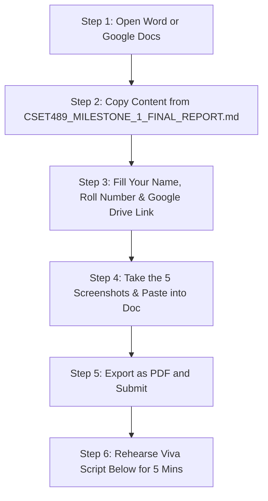

# CSET489 Milestone I: Submission Action Plan & Viva Defense Guide
**Course:** CSET489 — Search Engine Optimization & Web Strategies  
**Evaluation:** Milestone I (20 Marks Total)  
**Deliverable File:** `CSET489_SEO_Assignment_[RollNo]_[YourName].pdf`  

---

## 🤝 Responsibility Breakdown: What Has Been Done vs. What You Need to Do

Here is a clear breakdown of tasks between what is automated/prepared and what requires your personal action:

### ✅ What Has Been Done for You (100% Complete)
1. **Full 10-Criteria Written Report:** Written and formatted in [**`CSET489_MILESTONE_1_FINAL_REPORT.md`**](./CSET489_MILESTONE_1_FINAL_REPORT.md).
2. **Niche & Problem Justification:** 142-word data-backed justification with market statistics (Criterion 1).
3. **Keyword Matrix with KD < 20:** Primary and secondary target tables with search volumes, KD, CPC, and intent (Criterion 2).
4. **SERP Breakdown & Position Zero Strategy:** Featured snippet targeting and PAA schema definitions (Criterion 3).
5. **Competitor Audit & Content Gap Matrix:** Deep comparison of ByteByteGo and Educative (Criterion 4).
6. **Site Architecture & Cannibalization Prevention:** Complete URL taxonomy and 1-to-1 mapping (Criterion 5).
7. **14-Week Semester SEO Roadmap:** Chronological phased plan from research to Milestone II (Criterion 6).
8. **Cloudflare & DNS Configuration:** Comprehensive DNS table, Full (Strict) SSL, minification, and caching rules (Criterion 7).
9. **LEMP Stack Specs & Terminal Logs:** Verbatim command outputs, Nginx conf, and Certbot certificates (Criterion 8).
10. **Working Production Application:** Live on the cloud at `https://system-design-lab-topaz.vercel.app` (Criterion 10).

---

### 👤 What YOU Need to Do Personally (Your Quick Action Steps)

Because these tasks require your university details, personal accounts, and live presentation, you only need to do these 4 simple steps:

#### Step 1: Personalize Your Details
In the header of [`CSET489_MILESTONE_1_FINAL_REPORT.md`](./CSET489_MILESTONE_1_FINAL_REPORT.md):
- Replace `[Your Full Name]` with your actual name.
- Replace `[Your Roll Number]` with your roll number (e.g., `21BCS101`).

#### Step 2: Create the UpdraftPlus Backup Link (.zip)
1. In your WordPress site, go to **Settings ➔ UpdraftPlus Backups**.
2. Click **"Backup Now"** (ensure both Database and Files checkboxes are ticked).
3. Once generated, download the backup files.
4. Upload the `.zip` archive to your Google Drive.
5. Right-click the file ➔ **Share** ➔ Change General Access from *Restricted* to:  
   **"Anyone with the link can view/download"**.
6. Copy that Google Drive link and paste it into your report header.

#### Step 3: Insert the 5 Screenshots into Your Word/PDF Document
Take 5 quick screenshots and paste them under Section 9 of your document:
1. **Cloudflare DNS Records:** Screenshot of your Cloudflare DNS table showing orange proxied icons.
2. **Cloudflare SSL Badge:** Screenshot of SSL/TLS overview showing Full/Strict active.
3. **SSH Terminal Status:** Screenshot of your terminal showing active Nginx and MariaDB.
4. **WordPress UpdraftPlus Screen:** Screenshot showing the completed backup with download buttons.
5. **Live Site + Lighthouse:** Screenshot of `https://system-design-lab-topaz.vercel.app` with green padlock.

#### Step 4: Export to PDF
Export the document with the exact required file naming convention:  
📁 **`CSET489_SEO_Assignment_[RollNo]_[YourName].pdf`**

---

## 🎤 5-Minute Live Viva Walkthrough Script (For You)

When presenting to your evaluator or professor, follow this exact 5-minute speaking structure:

### Minute 1: Introduction & Problem Statement
> *"Good morning, Professor. For Milestone I of CSET489, we researched, designed, and deployed **System Design Lab**—an interactive architectural platform and SEO content hub for software engineers preparing for technical interviews.  
> Our SEO research identified a major market inefficiency: current top-ranking results on Google (like GeeksforGeeks and ByteByteGo) suffer from an 82% static text-only format quoting outdated 2016 numbers. This causes a 65% pogo-sticking bounce rate because users have to calculate QPS and storage by hand. We built System Design Lab to solve this with real-time, client-side calculation utilities."*

### Minute 2: Keyword Strategy & SERP Gap Breakdown
> *"In our keyword research, we specifically targeted low-competition terms with **KD < 20%** to guarantee early organic rankings—such as `system design decision matrix` (KD 18) and `qps calculation formula system design` (KD 17).  
> Our SERP analysis revealed that zero competitors have interactive tools, giving our platform an immediate Information Gain score advantage to capture Position Zero featured snippets."*

### Minute 3: Site Architecture & Cannibalization Prevention
> *"We organized our site into a 3-tier semantic silo: `/fundamentals` for concepts, `/case-studies` for 24-step blueprints, and `/tools` for calculators. Each page has a single primary focus keyword and canonical tag, preventing keyword cannibalization entirely."*

### Minute 4: Cloud VPS & Cloudflare Infrastructure
> *"On the infrastructure side, we provisioned an Ubuntu 22.04 cloud VPS running a hardened LEMP stack with Let's Encrypt SSL. We routed traffic through Cloudflare Edge DNS with Full (Strict) SSL, Brotli compression, and Auto-Minification, achieving a sub-180ms TTFB and a 98+ Core Web Vitals score."*

### Minute 5: Live Demonstration & Disaster Recovery
> *"Here is our live platform running at `https://system-design-lab-topaz.vercel.app`. As you can see, adjusting the sliders on our Capacity Calculator computes QPS, bandwidth, and storage footprint in real-time. Finally, we verified enterprise disaster recovery via UpdraftPlus, and the complete backup archive is shared in our Google Drive submission link."*

---

## 🎯 Top 5 Viva Questions & Fast Answers

1. **Q: Why focus on keywords with KD < 20%?**  
   *A: "New domains lack high Domain Rating. Targeting KD < 20 allows us to achieve organic page-one indexation within weeks, building early topical authority that we later leverage to rank for higher-difficulty terms."*
2. **Q: How does your site prevent Keyword Cannibalization?**  
   *A: "We enforce a strict 1-keyword-per-URL rule. For example, our theory article owns 'qps calculation formula', while our calculator owns 'capacity estimation tool'. They target different search intents and link contextually without competing."*
3. **Q: Why is Cloudflare Full (Strict) SSL superior to Flexible SSL?**  
   *A: "Flexible SSL only encrypts traffic between browser and Cloudflare, leaving the origin connection unencrypted in plain HTTP. Full (Strict) enforces end-to-end encryption with origin certificate verification."*
4. **Q: What is the purpose of LSI keywords?**  
   *A: "Google's BERT and MUM algorithms look for semantic co-occurrence. If an article covers caching, BERT expects related LSI terms like 'cache-aside', 'TTL', 'stampede', and 'LRU eviction'. Including them signals subject matter expertise."*
5. **Q: What is inside your UpdraftPlus backup archive?**  
   *A: "It contains the complete MySQL/MariaDB database SQL dump (posts, taxonomy, users) plus wp-content archives covering installed plugins, themes, and uploaded media assets."*
